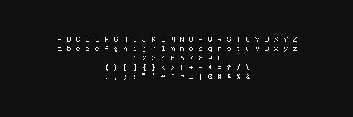
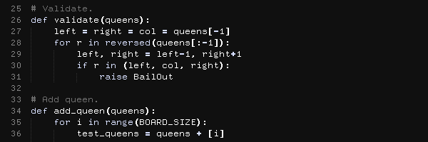
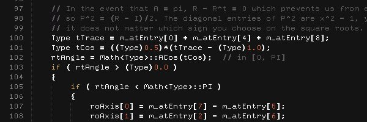

# Deccy

The font for crystal-clear coding.





To achieve greater code clarity and readability, the round, square, curly, and angle brackets are "hard-coded" to always appear bold. Same goes for dots, commas, the mathematical operators, and a few other characters.

Deccy looks best with text anti-aliasing turned off. If you are using Sublime Text, you can disable text anti-aliasing by adding the following to your User Settings file:

```
"font_options":
[
    "no_antialias"
]
```

On Mac, the optimal font size for Deccy would be either 12 or 25, depending on the DPI of your display. On Windows, the optimal font size would be either 10 or 19.

In Sublime Text, you could also add `"no_italic"` and `"no_bold"` to `"font_options"` if doing so makes sense with the syntax highlighting used.
